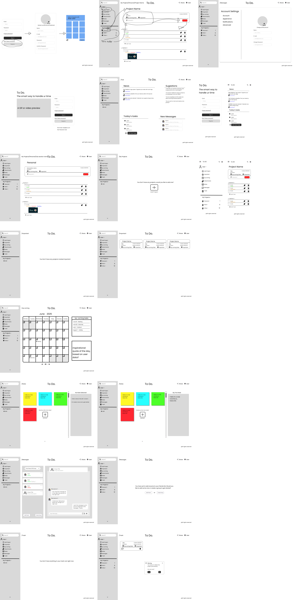
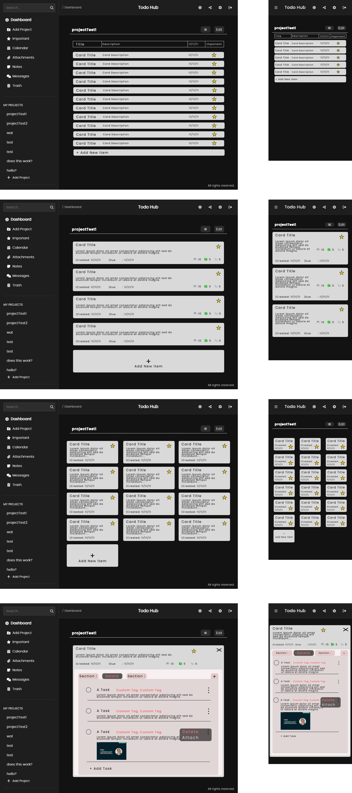

# ToDoHub

**By Sebastian Inaba**

ToDoHub is a full-stack task management web application built with HTML, CSS, JavaScript, Node.js, Express, MongoDB and Supabase. The project demonstrates secure user authentication, CRUD functionality, responsive design, and a clean UI built from scratch.

---

# Project Status

> **Currently On Hold**

This project is quite large and complex, and working on it has become draining at the moment. I decided to start it with a vanilla stack, which in hindsight makes it more challenging than it needs to be.  

Putting it on hold doesn’t mean I won’t finish it. I just want to shift focus to other projects for now. In the future, I might even convert the whole project to React and TypeScript, which would be more enjoyable but also time consuming.  

For now, I’m going to focus on fun and smaller MERN-stack projects that are better suited for my portfolio and career goals.

If there is any questions regarding this project please feel free to ask. 

---

### Tech Stack

- **Frontend:** HTML5, CSS3, JavaScript (Vanilla)
- **Backend:** Node.js, Express.js
- **Database:** MongoDB + Mongoose
- **Authentication & Security:** bcrypt (password hashing), JSON Web Tokens (JWT), cookie-parser, express-rate-limit, express-mongo-sanitize, cors, validator
- **Image Handling:** multer (file upload), sharp (image conversion to WebP)
- **Image Storage:** Supabase Storage
- **Design and Font:** Figma, Font awesome, Poppins (SIL Open Font License)
- **Utilities:** dotenv, nodemon

---

## Design

### Original Figma Design



Designed to explore various aspects of web development, the layout focuses on accessibility, mobile-first responsiveness, and simplicity.  
However, it is by no means finished, and the current design will most likely not be the final product.

Although this project is now on hold, here are the UX design i thought could work for the nested Task area.



The design is my intended UI/UX fix for the design hell of having 4 nested parts which all require CRUD, folder, cards view, modal of cards, sections as tabs, tasks, attachment, etc....

---

## Features (So Far and Things to Note)

- ✅ User registration and login with tokens and hashed passwords
- ✅ JWT tokens and refreshTokens use http-only cookies
- ✅ Profile picture upload and storage via Supabase with webP conversion
- 🟥 Refresh tokens are currently handled in a single POST route. While this works for basic auth, a more secure approach would be to store refresh tokens in a database, allowing you to track IP addresses, detect suspicious activity, and blacklist tokens when needed.
  However, it's probably better to set up authentication with a hosted service (like Firebase Auth, Supabase Auth, etc..) to reduce complexity and improve security with monitoring.
- 🟥 Api requests use `http://` in local development. In **production**, all API calls **must use `https://`** for secure communication
- 🟥 I tried i use **express-mongo-sanitize** however i could not get it to work, might be something i fix later
- 🟥 Google captcha is disabled for now since it keeps going "dormant".

---

## Deployment & Production Setup

Right now, the app connects to a local MongoDB and supabase instance for development purposes only. To run the app live and securely, follow these steps:

> **Note:** This app is not finished yet, so i don't recommend doing this at the moment. Thins that need configuration for this before trying is https setup for api requests and fetch location.

1. **Host your backend server and frontend**  
   Upload your backend code "server" (e.g., `server.js`, `models/user.js`, `routes/auth.js`, etc.).
   Upload your frontend code "public" (e.g., `index.html`, `assets`, `js`, etc.)

2. **Use a cloud-hosted MongoDB instance**  
   Make sure you have a cloud database set up with MongoDB Atlas or another cloud MongoDB provider. This database is accessible 24/7 and supports secure connections. Your backend should use the connection string stored in the environment variable MONGODB_URI to connect to this cloud database.

3. **Switch API requests to HTTPS in production**  
   Currently, API calls use `http://` for local development. In production, update your frontend API base URL to use `https://` to ensure secure communication with your backend.

4. **Check the code**
   I might have forgotten to mention something since a lot of the fetch calls form localhost, double check the code.

---

## Next Planned Improvements and Notes

- Connect each template to database to fetch relevant user data for that section

---

## Recent Update

- Project logic was added (only thing missing is proper deletion of attachments and UI/UX design)
- I have a design for the Projects i did in figma but i have not implemented it yet.

### What was done:

- **Project Component (Current State):**
    - Manages global state for projects, cards, sections, and tasks, including edit modes and selection states.
    - Handles file attachments with support for images and PDFs:
        - Uploads via a hidden global file input.
        - Uses signed URLs for secure viewing.
        - Optimistic state updates for fast UI feedback.
    - Implements CRUD operations for:
        - Projects (create, rename, load sidebar)
        - Cards (add, edit title/description, delete)
        - Sections (add, edit title, delete)
        - Tasks (add, edit title/description, toggle completion, delete)
    - Provides interactive UI features:
        - Edit mode toggle with select/delete multiple cards.
        - Inline contentEditable for cards, sections, and tasks.
        - Important task/card toggles, due date pickers, and tags.
        - Optimistic updates with pending save tracking.
    - Renders UI dynamically:
        - Cards, sections, tasks, and attachments are generated via JS.
        - Modular styling for cards, sections, tasks, and attachments.
        - Handles attachment previews and download/open functionality.
    - Includes utility functions:
        - `customConfirm` for confirm modals.
        - `setBreadcrumb` for navigation.
        - Drag-scroll support for project lists.


---

### Why this matters:

- **Refresh tokens** enable seamless, secure session renewal without forcing users to re-login frequently.
- Storing tokens in **HttpOnly cookies** prevents JavaScript access, protecting against XSS attacks.
- Using `SameSite: 'Strict'` and secure cookie settings helps guard against CSRF attacks.
- Backend always validates tokens on protected routes, ensuring users are authenticated before accessing private data.
- Frontend can handle session expiry smoothly (e.g., auto-refresh or redirect to login).
- **Supabase Storage** integration allows scalable and secure profile image handling without bloating the main database.
- These improvements increase **security**, **usability**, and **scalability** of the authentication and user profile system.

---

## How to Run Locally

1. **Clone the repository**

    ```bash
    git clone https://github.com/Sebastian-Inaba/ToDoHub
    cd ToDoHub
    ```

2. **Install dependencies**

    ```bash
    npm install
    ```

3. **Create a `.env` file with the following variables**

    ```
    MONGODB_URI=your_mongodb_connection_string
    JWT_SECRET=your_jwt_secret_key
    JWT_REFRESH_SECRET=your_jwt_refresh_secret_key

    # Supabase credentials (optional - for profile picture uploads, coming soon)
    SUPABASE_URL=your_supabase_url
    SUPABASE_KEY=your_supabase_anon_key
    SUPABASE_SERVICE_ROLE_KEY=your_supabase_service_role_key
    ```

4. **Run the app**

    ```bash
    npm start
    ```

    or

    ```
    npm run dev  # for development mode with nodemon
    ```

---

## License

This project is licensed under the MIT License. See the LICENSE file for details.